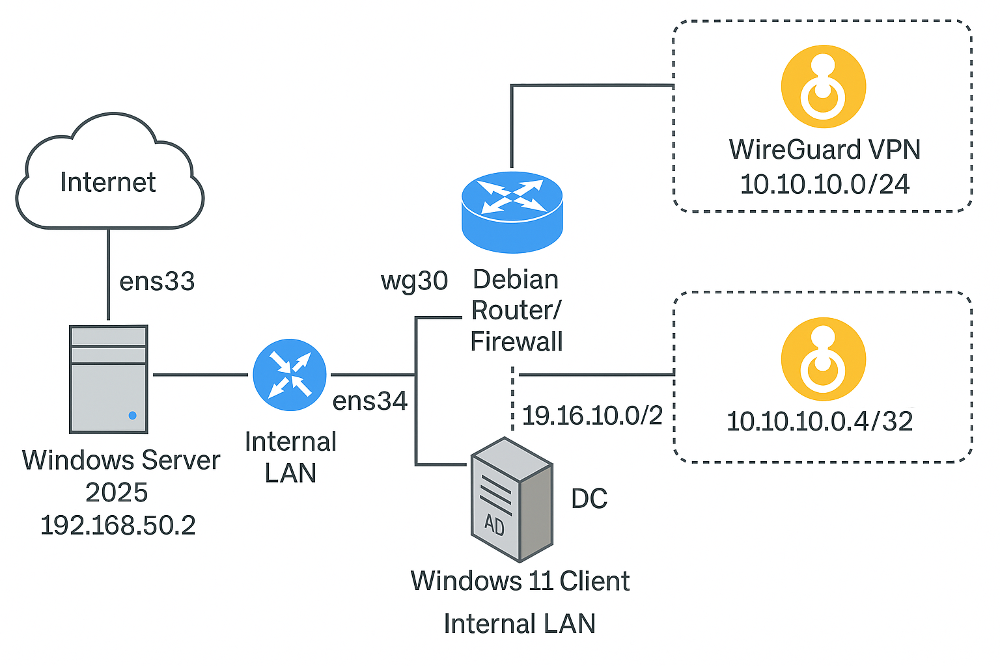
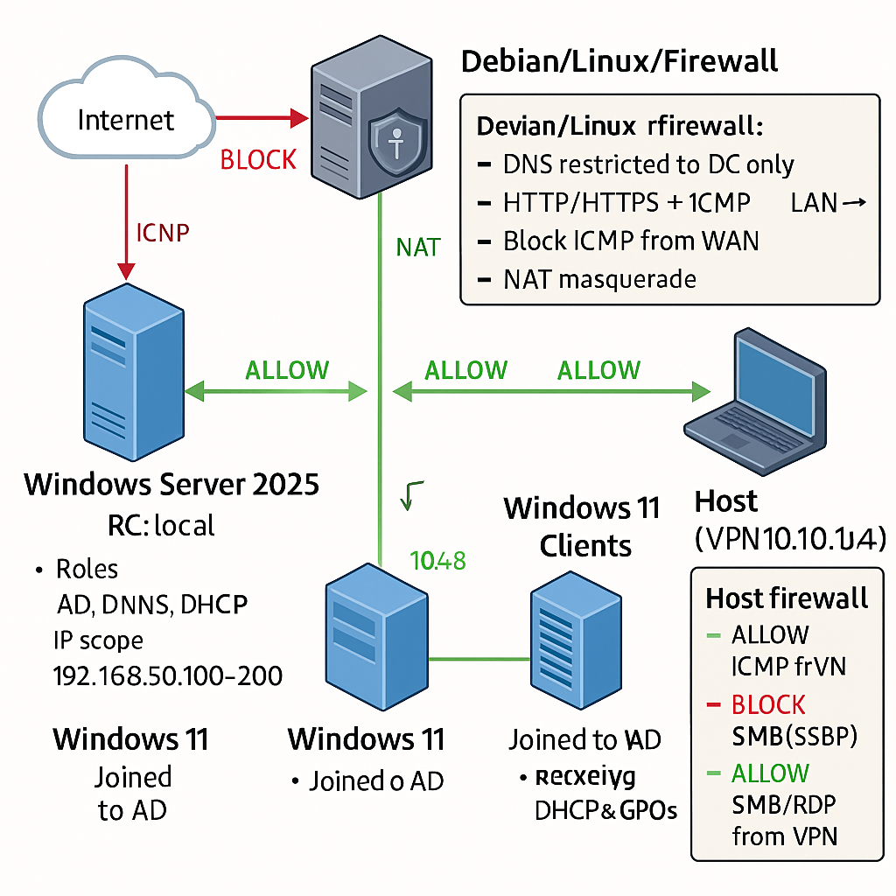

# 👋 Hi, I'm Vidal Reñao Lopelo  

💻 **Cloud & Network Engineer** | 🌍 Basel, Switzerland  
🎓 Cisco Certified (CCNA) | ⚡ Hands-on IT Labs | ☁️ Hybrid On-Prem & Cloud  

---

## 🚀 About Me
I’m an IT professional with experience in **Windows & Linux system administration, networking, and cloud integration**.  
I enjoy building **hands-on labs** that replicate real-world enterprise environments — from on-premises Active Directory to hybrid identity with Microsoft Entra ID.  

I believe in **learning by doing**, and I share my labs and documentation here to showcase my skills and help others.  

---

## 🛠️ Skills & Tools

- **Networking**: TCP/IP, DNS, DHCP, VPN, Firewalls (nftables, Cisco, Fortinet)  
- **Systems**: Windows Server AD DS, Group Policy, Linux Administration  
- **Cloud & Identity**: Microsoft 365, Azure, Microsoft Entra ID (Azure AD), Intune  
- **Automation**: PowerShell, Bash scripting  
- **Security**: Hardening, layered defense, access control, monitoring  
- **Dev Tools**: GitHub, Markdown, Documentation, Virtualization (VMware, VirtualBox)  

---

## 🏢 Featured Projects

🔹 [**Corporate IT Lab – Hybrid On-Prem & Cloud**](https://github.com/vidal-renao-admin/Corporate-Lab-Environment)  
A complete corporate-style lab with:
- Debian router/firewall (nftables, NAT, VPN)  
- Windows Server 2025 (AD, DNS, DHCP, GPOs)  
- Windows 11 domain clients  
- WireGuard VPN for secure access  
- **Hybrid Azure AD Join with Microsoft Entra ID**  

📊 Includes **diagrams, documentation, and implementation details** to demonstrate enterprise-level IT skills.  

---

## 🖼️ Current Lab Topology

## 🖼️ Current Lab Topology

---

## 📈 Next Goals
- Expand Intune/Autopilot integration for MDM  
- Add SIEM (Splunk/ELK) and monitoring (Zabbix/Prometheus)  
- Compare open-source firewall vs. Fortinet / Cisco ASA  
- Contribute more scripts & labs to the community  

---

## 🌍 Connect with Me
- 💼 [LinkedIn](https://www.linkedin.com/in/vidal-reñao-lopelo)  
- 📧 Email: vidal-31@hotmail.com  

---

✍️ *“Keep building, keep learning, keep sharing.”*  
